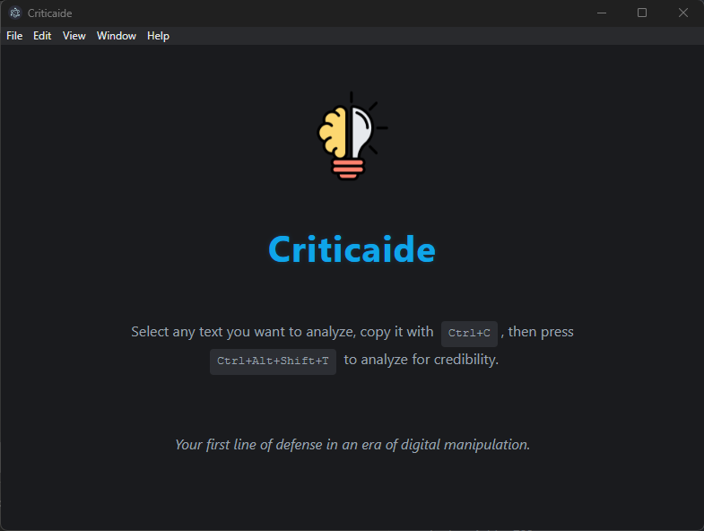

<div align="center">
    
</div>

# Criticaide

Your shield against digital manipulation in an era of information overload - a desktop application that helps you analyze text content for manipulation tactics while strengthening your critical thinking skills.

## Overview

Criticaide is a desktop application that uses local LLM capabilities to protect you from falling prey to misinformation, disinformation, and manipulative content. Using a sophisticated team of AI agents, it analyzes text to reveal potential manipulation techniques, credibility issues, and reasoning flaws. Simply select any text, copy it with Ctrl+C, and use the global shortcut (Ctrl+Alt+Shift+T / Cmd+Option+Shift+T) to see what might be lurking beneath the surface.

## The Problem Criticaide Solves

In today's digital landscape, we're constantly bombarded with content designed to manipulate our thoughts, emotions, and actions. Social media, news sites, and various online platforms are filled with persuasive content that:

- Appeals to our emotions rather than reason
- Exploits cognitive biases we all share
- Uses logical fallacies that appear sound but aren't
- Cites dubious sources or misrepresents credible ones
- Presents misleading statistics and technical information

This manipulation contributes to increasing polarization, erodes trust in institutions, and makes it harder to distinguish fact from fiction. Criticaide serves as your personal shield against these manipulation tactics while helping you develop stronger critical thinking skills over time.

## Features

- **Your Shield Against Manipulation**: Identifies potential manipulation techniques, credibility issues, and reasoning flaws in text content
  
- **Critical Thinking Development**: Helps you understand the mechanics of persuasion and manipulation through detailed analyses

- **Advanced Agent-Based Analysis**: Utilizes a system of specialized AI agents:
  - Identifies cognitive biases (confirmation bias, authority bias, etc.)
  - Detects emotional manipulation tactics (fear-mongering, outrage bait, etc.)
  - Uncovers logical fallacies (straw man arguments, false dichotomies, etc.)
  - Evaluates source credibility (attribution quality, source expertise, etc.)
  - Assesses technical accuracy (statistical integrity, causality claims, etc.)
  
- **Transparent Analysis Process**: Watch the analysis unfold in real-time as each specialist agent contributes its findings

- **Complete Privacy**: All processing happens locally on your machine using a local llama.cpp server - your data never leaves your device

- **Instant Analysis**: Global keyboard shortcuts (Ctrl+C and Ctrl+Alt+Shift+T / Cmd+Option+Shift+T) for quick analysis of any text you encounter

- **Detailed Insights** including:
  - Overall credibility score
  - Specific manipulation tactics with severity ratings
  - Key concerns highlighted
  - Actionable recommendations for further evaluation

## Prerequisites

- Windows 11 or macOS on Apple Silicon (arm64) architecture - *Note: macOS functionality should work but has limited testing since the developer doesn't have a Mac for thorough testing*
- Minimum 8GB RAM recommended (4GB minimum)
- 2GB free storage space
- GPU acceleration supported but not required

## Installation

1. Download the latest release from the [releases page](https://github.com/jruots/criticaide/releases)
2. Run the installer
3. Launch Criticaide
4. Once set up, you can begin analyzing text content by copying text with Ctrl+C and using the global keyboard shortcut (Ctrl+Alt+Shift+T / Cmd+Option+Shift+T)

## How It Works

When you analyze text with Criticaide, our agent system goes to work:

1. **Initial Screening**: A screener agent quickly evaluates if the content contains potential manipulation
2. **Analysis Planning**: An orchestrator agent determines which specialist analyses are needed
3. **Specialist Analysis**: Selected specialists analyze the text for specific manipulation tactics:
   - **Cognitive Bias Specialist**: Identifies how content leverages psychological biases
   - **Emotional Manipulation Specialist**: Detects appeals to fear, anger, or other emotions
   - **Logical Fallacy Specialist**: Uncovers flawed reasoning patterns
   - **Source Credibility Specialist**: Evaluates the reliability of cited information
   - **Technical Accuracy Specialist**: Examines factual claims and statistics
4. **Final Assessment**: A summarizer agent compiles the findings into an actionable report

All processing happens locally on your machine, ensuring user privacy.

## Technical Details

- **GPU Acceleration**: Utilizes Vulkan API for general GPU inference on Windows; Apple silicon is a first-class citizen through llama.cpp integration
- **Phi-3.5 instruct 3.8B parameter model**: Powerful yet efficient LLM for analysis
- **Heuristic context handling**: Manages context windows under the hood with token length estimation
- **Extensive logging system**: For troubleshooting and error reporting - again all local.
- **Dark mode interface**: With intuitive card-based layout for agent analysis results

## Development

This project is built with:
- Electron
- Node.js
- llama.cpp (Integrates the llama.cpp server binary for local LLM processing)

### Quick Start

```bash
# Clone the repository
git clone https://github.com/jruots/criticaide.git
```

Download the [llama.cpp binary](https://github.com/ggerganov/llama.cpp/releases) for the needed platform/s and set them in resources/llama/binaries/win and/or resources/llama/binaries/mac

```bash
# Install dependencies
npm install

# Run standard version in development mode
npm start
```

## Contributing

This is an evolving FOSS project aimed at strengthening critical thinking and reducing manipulation in our information ecosystem. Contributions, ideas, and feedback are welcome - so please do join me in making the world a better place! See the [Contributing Guidelines](https://github.com/jruots/criticaide/blob/main/src/docs/CONTRIBUTING.md) for more information.

## License

MIT License

## Acknowledgments

This project is built upon or inspired by the work of:

- [chatd](https://github.com/BruceMacD/chatd) - Some of the Electron app structure and implementations are based on this project
- [llama.cpp](https://github.com/ggerganov/llama.cpp) - Used as the underlying LLM service for text analysis
- App icon by [Karyative] on [Flaticon](https://www.flaticon.com/)

Both projects are MIT licensed. We're grateful to their creators and contributors.

Powered by Phi-3.5
